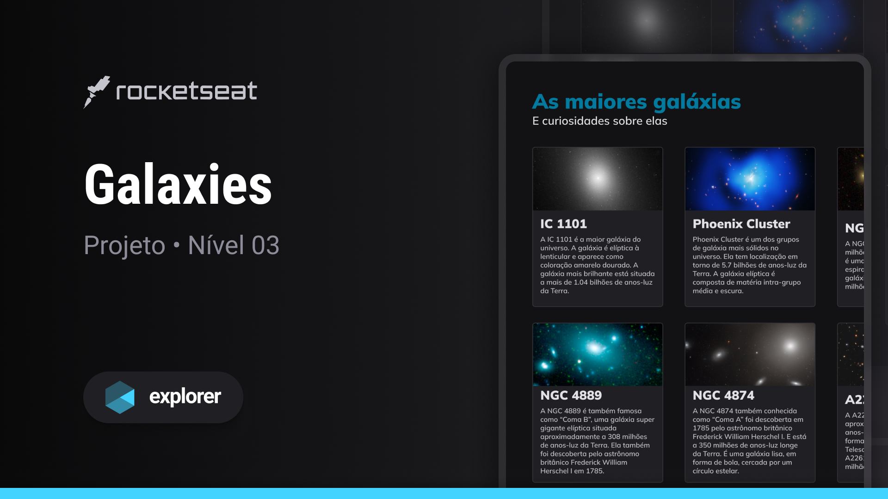

git
## 🖥️ Projeto

Esse é um projeto responsivo de uma capsula do tempo para exibir memórias em uma linha do tempo.

## 🚀 Tecnologias

Esse projeto foi desenvolvido durante a NLW da Rocketseat com as seguintes tecnologias:

- HTML
- CSS
- Git e Github